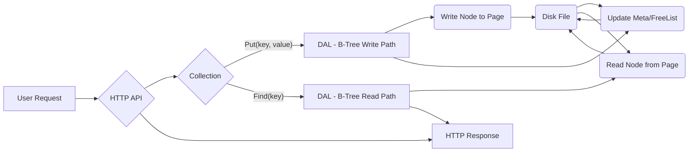

# DKV_DB

```mermaid
graph LR
    A[User Request] --> B{HTTP API};
    B --> C{Collection};
    C -- Put(key, value) --> D[DAL - B-Tree Write Path];
    C -- Find(key) --> E[DAL - B-Tree Read Path];
    
    D --> F(Write Node to Page);
    D --> G(Update Meta/FreeList);
    
    E --> H(Read Node from Page);

    F --> I(Disk File);
    G --> I;
    H --> I;

    I --> G;
    I --> H;

    B --> J[HTTP Response];
    E --> J;
```
## Build
```sh
$ docker build . -t dkvdb
```
## Run
```sh
$ docker run -v dkvdb:/data -e DB_PATH=/data/db.db -p 8180:8180 localhost/dkvdb:latest
```


